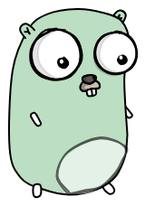

# goq
GoQ is a distributed (queue) event bus implemented in Go.

## features : 
- At Leas Once Delivery Mode will be supported.
- Batch Processing (High Throuhput) will be supported.
- This message queue is not sutiable for you if you need to publish only one entry and consume it back, but it's for you if you need to publish batches and consume the entire batch back.
- This message queue is sutiable if you need to transfer batch of events from one system to another.
- No retries

## Tech Stack : 


## Architecture : 
```go
cmd
|__ integration-test
    |__ main.go 
```